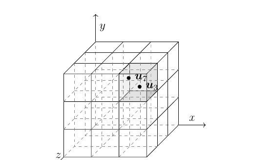

```{r setup, include=FALSE}
knitr::opts_chunk$set(echo = FALSE, message = F, warning = F)
library(reticulate)
```

# Statistical test description


In this short report I would like to perform some statistical test to check whether the sequence is random or not. In general the common part for each test is null hypothesis.

$H_0$ : The sequence is random
$H_A$ : The sequence is not random.

In most cases the interfere will be based on p-value. It's convienient to perform the 2nd level testing later. 

## $\chi^2$ test

Here we divide some interval into buckets and check distribution within bucket. Usually we will use equally length buckets. The test statistic is 

$$ \hat{\chi}^2=\sum_{i=1}^k \frac{\left(Y_i-n p_i\right)^2}{n p_i} .$$

* Test parameters
  + $k$ - number of categories/buckets
  + $p_i$ - probability that value belong to $i$-th bucket ($i=1,2,\ldots, k$)
* Statistic params explanation
  + $n$ - sample size
  + $Y_i$ - number of elements in sample belong to $i$-th bucket

Implementation ...

## Frequency monobit test

The test is designed for generator yielding binary sequences. Suppose we have a bit sequence $b_1, b_2, \ldots, b_i \in\{0.1\}$. We convert the sequence to $x_1, x_2, \ldots$ with values $\{-1,1\}$ via $x_i=2 b_i-1$. Test statistic is

$$
s_n(o b s)=\frac{1}{\sqrt{n}} \sum_{i=1}^n x_i .
$$
Under $H_0$ test statistic is approximetly $N(0,1)$ by CLT.

## KS-test 

This test is based on empircal cdf function and described in project document. For KS test I will use the implementation from **scipy** module.

[scipy.kstest](https://docs.scipy.org/doc/scipy/reference/generated/scipy.stats.kstest.html)

## Serial test ($m,L$)

Serial test is quite easy to understand test that incorporate relation between sequence's elements. Roughly speaking we split vector into $r$ equally length vectors  with dimension $m$ and check how they are distributed within $[0,1]^m$ hybercube. We divide the hybercube into $L^m$ smaller cubes (see picture below). Assuming that sequence is uniformly distributed we expect that the distribution within cubes should be also uniform. It multidimensional equivalent for ordinary $\chi^2$ test (if $m \geq 2$). 

The implementation is **serial_test** module.

{width=50%}


### Test parameters and statistic description

* Test parameters
  + $m$ - dimension of hypercube
  + $L$ - "number of bucket for each dimension" control the granularity
* Statistic paramas explanation
  + $r$ - number of vectors (dimension $m$) obtained from sample
  + $k = L^m$ - number of sub hypercube, granularity (should be significant lower than $r$)
  + $O_i$ - vector count in each $i$-th subhypercube

$$
X^2(obs)=\sum_{i=1}^k \frac{\left(O_i-r / k\right)^2}{r / k} .
$$
Under $H_0$ statistic has $\chi^2_{k-1}$ distribution.


# Testing binary expansion of constans 

In this section we perform frequency monobit test for number $\pi, e, \sqrt{2}$. More formally we will use their binary expansion as the random bit sequence. We use provided files with binary expansions. For inference we will follow instruction from official **NIST** report. 

Some important notes from report about most basic test. 


>2.1.5 Decision Rule (at the $1 \%$ Level)
>
> If the computed $P$-value is $<0.01$, then conclude that the sequence is non-random. Otherwise, conclude that the sequence is random.

>2.1.7 Input Size Recommendation
>
> It is recommended that each sequence to be tested consist of a minimum of 100 bits (i.e., $n \geq 100$).

```{python import-python-modules}
import pickle
import matplotlib.pyplot as plt
import numpy as np
import math
from scipy.stats import norm

byRow = 1
byCol = 0
```


```{python test}
def frequency_monobit_test(bits):
#   bits should be already mapped into [-1,1]
    n = len(bits)
    S = np.sum(bits)
    S_obs = abs(S) / math.sqrt(n)
    p_value = 2 * (1 - norm.cdf(S_obs))
    return p_value
```


```{python read-data-e}
with open('../data/binary_expansion_e.pkl', 'rb') as f:
    data = pickle.load(f)

numbers = data["numbers"]
sequence_e = 2 * numbers - 1 # map into -1 , 1 
```


```{python read-data-pi}

with open('../data/binary_expansion_pi.pkl', 'rb') as f:
    data = pickle.load(f)

numbers = data["numbers"]
sequence_pi = (2 * numbers - 1) # map into -1 , 1 
```


```{python read-data-sqrt2}

with open('../data/binary_expansion_sqrt2.pkl', 'rb') as f:
    data = pickle.load(f)

numbers = data["numbers"]
sequence_sqrt2 = 2 * numbers - 1 # map into -1 , 1 
```

```{python calculate-pval-for-constants}

p_val =	{
  "pi": frequency_monobit_test(sequence_pi),
  "e": frequency_monobit_test(sequence_e),
  "sqrt2": frequency_monobit_test(sequence_sqrt2)
}

length =	{
  "pi": len(sequence_pi),
  "e": len(sequence_e),
  "sqrt2": len(sequence_sqrt2)
}

```


| Constant name  |  $p_{value}$ | Input Size|
|---|---|---|
| $\pi$  |`r py$p_val["pi"]`| `r py$length["pi"]` |
| $e$  |`r py$p_val["e"]`| `r py$length["e"]`|
| $\sqrt{2}$  |`r py$p_val["sqrt2"]`|`r py$length["sqrt2"]` | 

The size of out data is aligned  with **NIST** recommendations. Authors recommend $0.01$ as significance level for PRNG testing. From above table we conclude that binary expansion of each mentioned constants could be considered as random bit sequence. 


## Second level testing for bits

Because the size of sample are quite big we can try another approach. We split the sequence into a lot of smaller samples. We use the smallest recommended $n=100$ for this test. The split method will be very straightforward. We simply take first $100$ bits for first sample, another $100$ for second sample and so on.

```{python split-into-many-samples}
default_sample_size = 100

def trim_to_multiple_of_n (array, n):
    sample_number = int(len(array) / n)
    return (array[:(sample_number * n)], sample_number)

def make_matrix_with_samples(array, n = default_sample_size):
  seq, sample_number = trim_to_multiple_of_n(array, n)
  seq = seq.reshape((sample_number, n))
  return seq
  

sequence_sqrt2_samples = make_matrix_with_samples(sequence_sqrt2)
p_values_sequence_sqrt2_samples = np.apply_along_axis(frequency_monobit_test, byRow, sequence_sqrt2_samples)

sequence_e_samples = make_matrix_with_samples(sequence_e)
p_values_sequence_e_samples = np.apply_along_axis(frequency_monobit_test, byRow, sequence_e_samples)

sequence_pi_samples = make_matrix_with_samples(sequence_pi)
p_values_sequence_pi_samples = np.apply_along_axis(frequency_monobit_test, byRow, sequence_pi_samples)
```


```{python plot-sqrt2}

plt.clf()
x = plt.hist(p_values_sequence_sqrt2_samples, bins = "auto")
x = plt.title("P value distribution for p_values $\sqrt{2}$")
plt.show()
```

```{python plot-e}

plt.clf()
dummy = plt.hist(p_values_sequence_e_samples, bins = "auto")
dummy = plt.title("P value distribution for p_values $e$")
plt.show()
```


```{python plot-pi}
plt.clf()
dummy =  plt.hist(p_values_sequence_pi_samples, bins = "auto")
dummy = plt.title("P value distribution for p_values $\pi$")
plt.show()
```


We can take a look at the histogram of p values. For me it doesn't look like uniformly distribute. 

```{python fraction-that-pass-frequency}

def calculte_fraction(p_values, significant_level = 0.01):
    return np.count_nonzero(p_values > significant_level) / len(p_values)
    
fraction_pi  = calculte_fraction(p_values_sequence_pi_samples)
fraction_e  = calculte_fraction(p_values_sequence_e_samples)
fraction_sqrt2  = calculte_fraction(p_values_sequence_sqrt2_samples)
```

In below table we can see what fraction of samples  pass the test. 

| Constant name  |  Fraction that pass |
|---|---|---|
| $\pi$  |`r py$fraction_pi`|
| $e$  |`r py$fraction_e`| 
| $\sqrt{2}$  |`r py$fraction_sqrt2`|


# Generator description

First we give some basic idea of generators.


## Linear congurent 

The most basic one using linear dependence as function of previous element.

$$
x_{n+1}=\left(a x_n+c\right) \quad \bmod M .
$$

## Generalized linear congurent

Natural extension on above. Now the output is generated based on last $k$ elements in sequence. Note that the seed is now $k$ element sequence instead of single number.

$$
x_n=\left(a_1 x_{n-1}+a_2 x_{n-2}+\ldots+a_k x_{n-k}+c\right) \quad \bmod M .
$$

## Excell

Weird one. Probably used in earlier MS Office implementation (but hard to find some information). This is LCG  with non-integeer coefficients. Yielding number from $[0,1]$.


$$
u_i=\left(0.9821 u_{i-1}+0.211327\right) \quad \bmod 1
$$

## MT19937

Implementation from numpy module.

To do. Add description.


## RC(32)

The RC(32) random generator is a computational tool designed to produce sequences of random or pseudorandom numbers within a defined range. It typically employs algorithms optimized for speed and uniform distribution, making it suitable for simulations, cryptography, and data sampling. With its 32-bit architecture, the generator can provide high precision and a large range of outputs, ensuring versatility for various applications. Modern implementations often focus on enhancing randomness quality, reducing predictability, and adhering to statistical randomness tests like DIEHARD or TestU01. The RC(32) is favored in environments where reliable randomness is critical, such as in secure key generation or randomized algorithms. Additionally, its efficiency ensures minimal computational overhead, making it well-suited for embedded systems and high-performance computing tasks.

I provide some naive python implementation in *PRGA* and *KSA* modules. I will use my birthday (from year, month and day) as key (mod 32). So the key is [15, 8, 29].

```{python import-RC-module}
from PRGA import PRGA
from KSA import Keys, KSA
import time

```

```{python generate-seq-prga}
sample_size  = int(1e6)

keys = Keys(np.array([15, 8, 29]))
ksa = KSA(m=32)
ksa.schedule(keys)
prga = PRGA(ksa)
start = time.time()
sample_rc = prga.get_random(sample_size)
end = time.time()
print("Elapsed generation time of sample size = %d is %ss" % (sample_size, end - start))
```
We can check how the sequence begin `r py$sample_rc[0:50]`...

```{python plot-from-rc, include = F}

plt.clf()
dummy = plt.hist(sample_rc, bins = list(range(32)))
dummy = plt.title("P value distribution for p_values $e$")
plt.show()

```


```{python simple-generators}
#TODO why not working with dedicated module

def lcg(m, a, c, x):
    return (a * x + c) % m


def get_n_lcg(m, a, c, init, size):
    result = np.empty(size, dtype=np.uint32)
    assert size >= 1, "Incorrect size"
    result[0] = lcg(m, a, c, init)
    for i in range(1, size):
        result[i] = lcg(m, a, c, result[i - 1])
    return result
  
def generalized_lcg(m, a, c, x):
    return (np.sum(a * x) + c) % m


def get_n_glcg(m, a, c, init, size):
    assert size >= 1, "Incorrect size"
    depth = len(init)
    result = np.empty(size, dtype=np.uint32)
    result = np.concatenate((init, result))
    for i in range(depth, size+depth):
        result[i] = generalized_lcg(m, a, c, result[i-depth:i])
    return result[-size:]


def excell_gen(x):
    return (0.9821 * x + 0.211327) % 1
  

def generate_excell_sample(seed, size):
    sample = np.zeros(size)
    current_value = seed
    for i in range(size):
      current_value = excell_gen(current_value)
      sample[i] = current_value
    return sample
```

## LCG($13,1,5$) used seed = $42$

```{python genenererate-seq-lcg-13}

seed = 42

simple_lcg_sample = get_n_lcg(13, 1, 5, seed, size=int(1e6))


```


We can check how the sequence begin `r py$simple_lcg_sample[0:26]`...

For this example we can observe period of generator due relative small parameter $M$. The period can't be greater than $M$, so here just by looking on first 26 elements we can see the how the sequence repeat. 


## LCG($2^{10},3,7$)  used seed = $42$

```{python genenererate-seq-lcg-1024}

seed = 42

lcg_sample = get_n_lcg(2**10, 3, 7, seed, size=int(1e6))

```

We can check how the sequence begin `r py$lcg_sample[0:50]`...

Comparing with previous example we can't determine the period by manual inspection now.

```{python plot-path-for-lcg}
trajectory = lcg_sample[0:50]
sample_size = len(trajectory)

plt.clf()
plt.figure(figsize=(10, 6))
plt.plot(range(sample_size), trajectory, marker='o', linestyle='-', label='Sequence with seed=42', color = "red")
plt.title(f'Trajectory of LCG($2^{10}, 3, 7$) with seed = 42) ', fontsize=14)
plt.xlabel('Iteration', fontsize=12)
plt.ylabel('Generated Value', fontsize=12)
plt.grid(True, linestyle='--', alpha=0.7)
plt.legend(fontsize=12)
plt.show()

```


## GLCG($2^{10},{3,7, 68}$)

```{python g-lcg-seq}

a = np.array([3, 7, 68])
seed = np.array([1,1,1])

sample_glcg = get_n_glcg(2 ** 10, a, 0, seed, size = int(1e6))

```

We can check how the sequence begin `r py$sample_glcg[0:50]`.

Due complexity of PRNG and relative large $M$ we can't see the pattern now. Even graph inspection won't help.

```{python plot-path-for-glcg}
trajectory = sample_glcg[0:100]
sample_size = len(trajectory)

plt.clf()
plt.figure(figsize=(10, 6))
plt.plot(range(sample_size), trajectory, marker='.', linestyle='--', linewidth = 0.5 ,label='Sequence with seed=42', color = "red")
plt.title(f'Trajectory of GLCG($2^{10}, {3,7, 68})$ with seed = 42) ', fontsize=14)
plt.xlabel('Iteration', fontsize=12)
plt.ylabel('Generated Value', fontsize=12)
plt.grid(True, linestyle='--', alpha=0.7)
plt.legend(fontsize=12)
plt.show()
```

## Excell 


```{python excell}

seed = 0.5
sample_size = int(100)
excell_sample = generate_excell_sample(seed, sample_size)
excell_sample2 = generate_excell_sample(2, sample_size)

```

```{python plot-trajectory}

trajectory  = excell_sample

plt.clf()
plt.figure(figsize=(10, 6))
plt.plot(range(sample_size), trajectory, marker='o', linestyle='-', label='Sequence with seed=0.5', color = "red")
plt.plot(range(sample_size), excell_sample2, marker='o', linestyle='-', label='Sequence with seed=2', color = "blue")
plt.title(f'Trajectory of excell_gen PRNG', fontsize=14)
plt.xlabel('Iteration', fontsize=12)
plt.ylabel('Generated Value', fontsize=12)
plt.ylim(0, 1)
plt.grid(True, linestyle='--', alpha=0.7)
plt.legend(fontsize=12)
plt.show()

```


Plotting the trajectory of beginning give us overview of quality of such generator. Maybe it simple and fast but not safe. We can observe pattern easily for difference seeds. 


